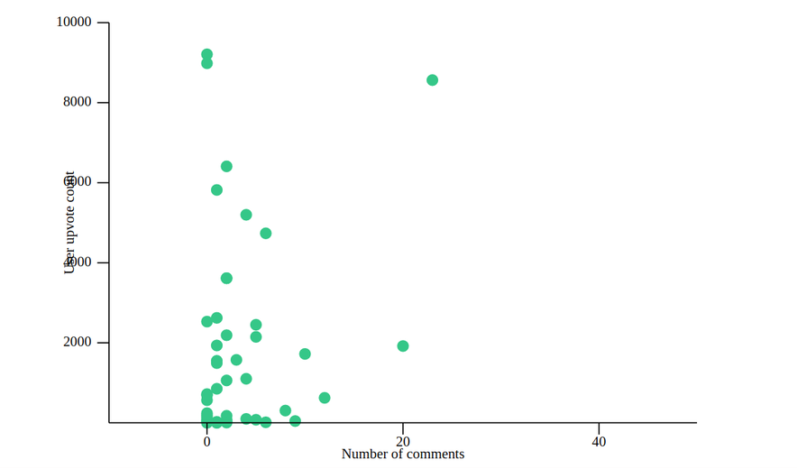

# VisualRants

VisualRants consumes the [DevRant](https://devrant.com/feed) API and generates graphs based on a rant's data.


### Tech

* [StructOpt](https://github.com/TeXitoi/structopt) - Tool to parse command line arguments, based on [clap](https://crates.io/crates/clap).
* [Plotlib](https://docs.rs/plotlib/0.3.0/plotlib/) - Data plotting and rendering library


----
### Installing

Building VisualRants requires [rustup](https://github.com/rust-lang/rustup.rs), version 1.14.0 or more recent. If you have an older version, run ```rustup self update```


### Commandline Arguments

* ```-s SORT``` sets how you want rants to be sorted
* ```-r RANGE``` sets the time period to fetch rants from
* ```-l LIMIT``` sets the number of rants to fetch
* ```--skip SKIP``` sets the number of rants to skip. Defaults to zero

To display help, type ```cargo run -- --help```

#### Examples
The following are some example commands

```cargo run -- -s algo -r day -l 50 --skip 1```

```cargo run -- -r month -s algo -l 20```

### Screenshots


User upvotes against number of comments on rant


User upvote count against rant upvote count

### Current Work

Save fetched rants to MySQL


### License

This is provided under [MIT](https://github.com/okevese/VisualRants/blob/master/LICENSE).